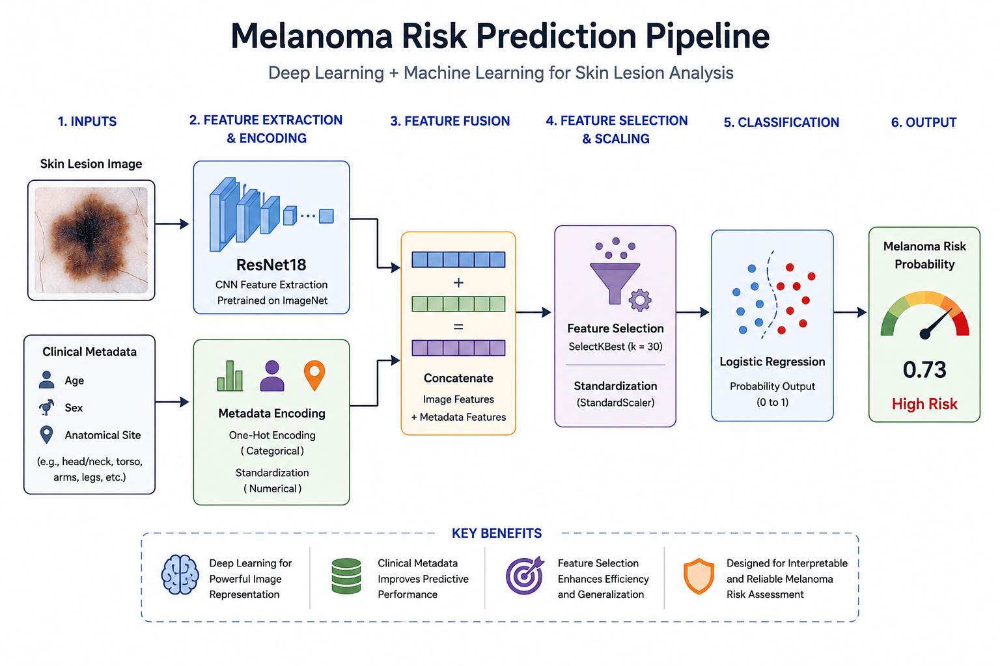
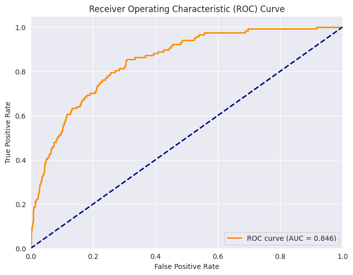
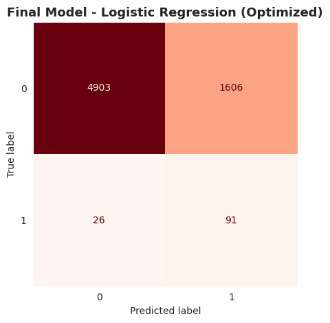

# Melanoma Risk Classification Using Deep Learning and Clinical Metadata

## Overview

This project explores the use of deep learning and machine learning techniques for melanoma risk classification using dermoscopic skin lesion images and patient clinical metadata.

The system combines image-based feature extraction using a pretrained ResNet18 convolutional neural network (CNN) with structured patient information including age, sex, and anatomical site. These features are integrated into a traditional machine learning pipeline optimized for highly imbalanced medical classification.

A deployed interactive application was also developed using Gradio and Hugging Face Spaces to demonstrate real-time melanoma risk prediction.

---

## Project Objectives

- Develop a hybrid deep learning + machine learning classification pipeline
- Address severe class imbalance in melanoma detection
- Evaluate performance using metrics appropriate for medical AI systems
- Deploy the model as an interactive web application

---

## Dataset

This project uses the SIIM-ISIC Melanoma Classification dataset from Kaggle.

The dataset includes:
- Dermoscopic skin lesion images
- Patient metadata
- Binary melanoma classification labels

Due to significant class imbalance (~2% melanoma cases), specialized evaluation strategies and threshold optimization were required.

---

## Methodology

### 1. Image Feature Extraction

A pretrained ResNet18 CNN was used as a feature extractor. The final classification layer was removed, allowing deep image embeddings to be extracted from each lesion image.

### 2. Metadata Processing

Clinical metadata included:
- Age
- Sex
- Anatomical lesion site

Categorical variables were encoded using OneHotEncoder.

### 3. Feature Engineering

Image embeddings and encoded metadata were combined into a unified feature space.

Additional preprocessing steps included:
- Feature selection
- Standardization
- Threshold optimization

### 4. Classification

A Logistic Regression classifier was trained using:
- Class weighting
- Optimized probability thresholding
- Evaluation focused on minority-class performance

---

## Model Performance

Because melanoma detection is a highly imbalanced classification problem, evaluation focused on medically relevant metrics beyond accuracy.

### ROC Curve

The ROC curve evaluates how well the model separates melanoma from benign lesions across different thresholds. The model achieved strong overall discrimination performance.

### Precision-Recall Curve

The Precision-Recall curve provides a more informative evaluation for imbalanced medical datasets by focusing specifically on melanoma detection performance and the trade-off between recall and precision.

---

## Project Visuals

## Pipeline Diagram



---

## ROC Curve



---

## Confusion Matrix



---

## Application Demo

The project was deployed using Gradio and Hugging Face Spaces.

### Live Demo

[Launch Application](https://huggingface.co/spaces/SelamDS/melanoma-risk-app)

---

## Technologies Used

- Python
- PyTorch
- Scikit-learn
- Pandas
- NumPy
- OpenCV
- Gradio
- Hugging Face Spaces

---

## Repository Structure

```text
Melanoma-Risk-Classification/
│
├── app.py
├── README.md
├── requirements.txt
├── melanoma_pipeline.pkl
├── encoded_feature_order.pkl
│
├── notebooks/
│   └── Melanoma_Risk_Classification.ipynb
│
├── images/
│   ├── melanoma-demo.mp4
│   ├── melanoma-app-preview.png
│   ├── melanoma-confusion-matrix.png
│   ├── melanoma-pipeline-diagram.png
│   └── melanoma-roc-curve.png
